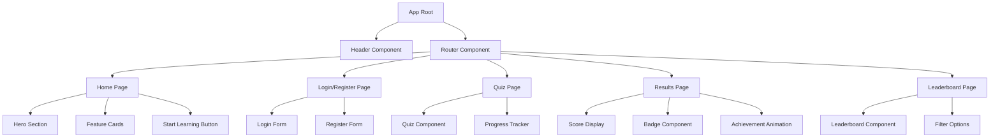
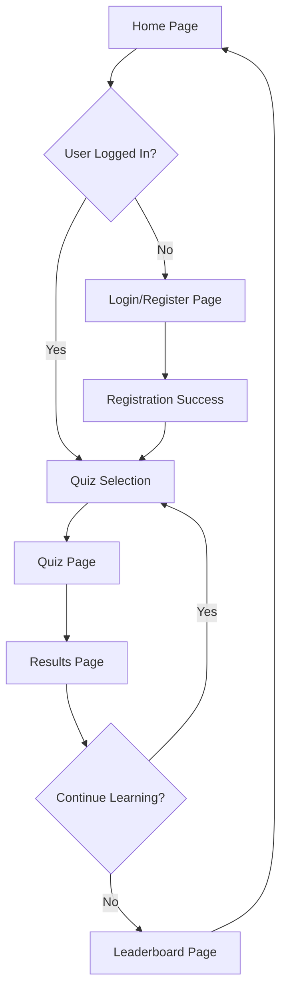
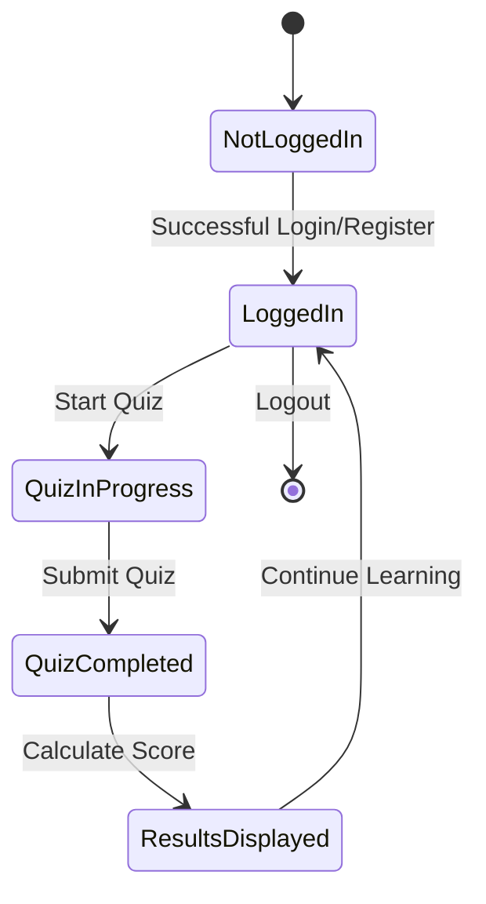

# ShikshaPlay - Gamified Learning Website Design Document

## Overview

ShikshaPlay is a gamified learning platform designed specifically for rural students to make education engaging and accessible. The platform combines educational content with game mechanics to motivate learning through points, badges, and leaderboards.

### Project Vision
To create an interactive, fun, and colorful educational platform that transforms traditional learning into an engaging game-like experience for rural students.

### Target Audience
- Primary: Rural students (ages 8-16)
- Secondary: Teachers and educational facilitators in rural areas

### Core Features
- User authentication and registration
- Interactive quiz system
- Points and badge reward system
- Student leaderboards
- Progress tracking

## Technology Stack & Dependencies

### Frontend Framework
- **HTML5/CSS3/JavaScript** - Core web technologies for maximum compatibility
- **Bootstrap 5** - Responsive design framework
- **Font Awesome** - Icon library for educational and gaming icons
- **Animate.css** - Animation library for engaging interactions

### Design System
- **Color Palette**: Blue (#007bff), Green (#28a745), Yellow (#ffc107)
- **Typography**: Kid-friendly fonts (Comic Sans MS, Open Sans)
- **Icons**: Educational (books, pencils), Gaming (trophies, stars), Navigation (arrows, buttons)

### Browser Compatibility
- Chrome, Firefox, Safari, Edge
- Mobile-responsive design for tablets and smartphones

## Component Architecture

### Component Definition

#### 1. Header Component
```
Header Component
├── Logo (ShikshaPlay)
├── Navigation Menu
└── User Profile Badge (when logged in)
```

**Props/State:**
- `isLoggedIn`: boolean
- `userName`: string
- `userPoints`: number

#### 2. Quiz Component
```
Quiz Component
├── Question Display
├── Multiple Choice Options (3 options)
├── Progress Bar
├── Timer (optional)
└── Submit Button
```

**Props/State:**
- `question`: object
- `selectedAnswer`: string
- `currentQuestionIndex`: number
- `totalQuestions`: number

#### 3. Badge Component
```
Badge Component
├── Badge Icon
├── Badge Name
├── Achievement Description
└── Unlock Animation
```

**Props/State:**
- `badgeType`: string
- `isUnlocked`: boolean
- `animationTrigger`: boolean

#### 4. Leaderboard Component
```
Leaderboard Component
├── Ranking Table
├── Student Names
├── Points Display
└── Badge Indicators
```

**Props/State:**
- `students`: array
- `currentUser`: object
- `sortBy`: string

### Component Hierarchy



## Routing & Navigation

### Route Structure
```
/ (Home Page)
├── /login (Login/Register Page)
├── /quiz (Quiz Page)
│   ├── /quiz/:subject
│   └── /quiz/:subject/:level
├── /results (Results Page)
└── /leaderboard (Leaderboard Page)
```

### Navigation Flow


## Styling Strategy

### Color Scheme
- **Primary Blue (#007bff)**: Headers, buttons, progress bars
- **Success Green (#28a745)**: Correct answers, achievement badges
- **Warning Yellow (#ffc107)**: Highlights, attention elements
- **Light Gray (#f8f9fa)**: Background, cards
- **Dark Gray (#343a40)**: Text, borders

### Typography Scale
```css
/* Headings */
h1: 2.5rem (40px) - Comic Sans MS
h2: 2rem (32px) - Comic Sans MS
h3: 1.5rem (24px) - Open Sans

/* Body Text */
body: 1rem (16px) - Open Sans
small: 0.875rem (14px) - Open Sans
```

### Icon Strategy
- **Educational Icons**: 📚 Books, ✏️ Pencils, 🎓 Graduation caps
- **Gaming Icons**: 🏆 Trophies, ⭐ Stars, 🎖️ Medals
- **Navigation Icons**: ➡️ Arrows, 🏠 Home, 👤 Profile

### Animation Guidelines
- **Button Hover**: Scale transform (1.05x)
- **Badge Unlock**: Bounce animation with sparkle effect
- **Quiz Feedback**: Color transition for correct/incorrect answers
- **Page Transitions**: Fade in/out effects

## State Management

### Local Storage Strategy
```javascript
// User Data
{
  userId: "string",
  userName: "string",
  userClass: "string",
  totalPoints: number,
  unlockedBadges: array,
  completedQuizzes: array,
  loginTimestamp: timestamp
}

// Quiz Progress
{
  currentQuiz: "string",
  currentQuestion: number,
  answers: array,
  startTime: timestamp,
  timeSpent: number
}
```

### State Flow


## Data Models & Local Storage

### User Model
```javascript
User {
  id: string (auto-generated)
  name: string (required)
  class: string (required)
  totalPoints: number (default: 0)
  badges: array of Badge objects
  createdAt: timestamp
  lastActive: timestamp
}
```

### Quiz Model
```javascript
Quiz {
  id: string
  subject: string
  level: string (beginner/intermediate/advanced)
  questions: array of Question objects
  pointsPerQuestion: number
  timeLimit: number (optional)
}

Question {
  id: string
  text: string
  options: array[3] of strings
  correctAnswer: number (0-2 index)
  explanation: string (optional)
}
```

### Badge Model
```javascript
Badge {
  id: string
  name: string
  description: string
  icon: string
  criteria: object {
    type: string (points/quizzes/streak)
    value: number
  }
  rarity: string (common/rare/legendary)
}
```

### Leaderboard Model
```javascript
LeaderboardEntry {
  userId: string
  userName: string
  userClass: string
  totalPoints: number
  badgeCount: number
  rank: number
}
```

## API Integration Layer

### Mock Data Structure
Since this is a frontend-focused application, we'll use mock data stored locally:

```javascript
// Mock Quiz Data
const mockQuizzes = [
  {
    id: "math-basic",
    subject: "Mathematics",
    level: "beginner",
    questions: [
      {
        id: "q1",
        text: "What is 5 + 3?",
        options: ["6", "8", "10"],
        correctAnswer: 1,
        explanation: "5 plus 3 equals 8"
      }
      // More questions...
    ]
  }
  // More quizzes...
];

// Mock Badge Data
const mockBadges = [
  {
    id: "first-quiz",
    name: "First Steps",
    description: "Complete your first quiz",
    icon: "🌟",
    criteria: { type: "quizzes", value: 1 },
    rarity: "common"
  }
  // More badges...
];
```

### Data Persistence Strategy
- **LocalStorage**: User progress, scores, badges
- **SessionStorage**: Current quiz state, temporary data
- **Future Enhancement**: Backend API integration for multi-device sync

## Page Specifications

### 1. Home Page
```
Home Page Layout
├── Header Section
│   ├── ShikshaPlay Logo
│   └── Navigation Menu
├── Hero Section
│   ├── Welcome Message
│   ├── Tagline: "Learn. Play. Achieve!"
│   └── Start Learning Button (CTA)
├── Features Section
│   ├── Quiz Icon + Description
│   ├── Badges Icon + Description
│   └── Leaderboard Icon + Description
└── Footer Section
```

**Key Elements:**
- Vibrant hero image with students learning
- Animated "Start Learning" button
- Feature cards with hover effects
- Testimonial section (optional)

### 2. Login/Register Page
```
Login/Register Page Layout
├── Toggle Tabs (Login | Register)
├── Login Form
│   ├── Name Input
│   ├── Class Selection Dropdown
│   └── Login Button
├── Register Form
│   ├── Name Input (required)
│   ├── Class Selection (required)
│   ├── Confirm Button
│   └── Terms Agreement Checkbox
└── Motivational Graphics
```

**Validation Rules:**
- Name: Required, minimum 2 characters
- Class: Required selection from dropdown
- Duplicate name handling within same class

### 3. Quiz Page
```
Quiz Page Layout
├── Progress Header
│   ├── Question Counter (1/10)
│   ├── Progress Bar
│   └── Current Points Display
├── Question Section
│   ├── Question Text
│   └── Question Image (optional)
├── Options Section
│   ├── Option A (Radio Button)
│   ├── Option B (Radio Button)
│   └── Option C (Radio Button)
├── Action Buttons
│   ├── Submit Answer Button
│   └── Next Question Button
└── Encouragement Messages
```

**Interactive Features:**
- Option selection with visual feedback
- Immediate answer validation
- Encouraging messages for correct/incorrect answers
- Progress saving between questions

### 4. Results Page
```
Results Page Layout
├── Score Celebration Section
│   ├── Total Points Earned
│   ├── Percentage Score
│   └── Performance Message
├── Badges Section
│   ├── Newly Unlocked Badges
│   └── Badge Unlock Animations
├── Progress Overview
│   ├── Questions Answered
│   ├── Correct/Incorrect Breakdown
│   └── Time Taken
├── Action Buttons
│   ├── Try Another Quiz
│   ├── View Leaderboard
│   └── Share Achievement
└── Motivational Quote
```

**Animation Sequence:**
1. Score counter animation
2. Badge unlock celebrations
3. Progress bar animations
4. Call-to-action button reveals

### 5. Leaderboard Page
```
Leaderboard Page Layout
├── Header Section
│   ├── Trophy Icon
│   ├── "Top Performers" Title
│   └── Filter Options (All/Class/Week)
├── Current User Highlight
│   ├── Your Rank Badge
│   ├── Points Display
│   └── Badges Count
├── Rankings Table
│   ├── Rank Column
│   ├── Name Column
│   ├── Class Column
│   ├── Points Column
│   └── Badges Column
└── Motivation Section
    ├── Weekly Challenges
    └── Achievement Tips
```

**Ranking Features:**
- Top 3 podium display
- Current user highlighting
- Class-based filtering
- Weekly/monthly leaderboards

## Testing Strategy

### Unit Testing
- Form validation functions
- Score calculation logic
- Badge unlock conditions
- Local storage operations

### Integration Testing
- Page navigation flow
- Quiz completion workflow
- User registration process
- Leaderboard updates

### User Experience Testing
- Mobile responsiveness
- Loading time optimization
- Accessibility compliance
- Cross-browser compatibility

### Performance Testing
- Page load speeds
- Animation performance
- Local storage efficiency
- Memory usage optimization

## Accessibility Features

### Screen Reader Support
- Semantic HTML structure
- ARIA labels for interactive elements
- Alt text for all images
- Focus management for keyboard navigation

### Visual Accessibility
- High contrast color combinations
- Scalable font sizes
- Clear visual hierarchy
- Color-blind friendly palette

### Motor Accessibility
- Large click targets (minimum 44px)
- Keyboard navigation support
- Voice recognition compatibility
- Touch-friendly mobile design